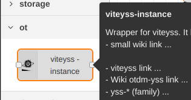

# node-red-contrib-viteyss

 node-red contrib viteyss wrapper.

### dependencies

- Node-red
- viteyss
- 

### installation

* Manual way. In terminal

```bash
cd ~/.node-red
TODO npm i https://github.com/yOyOeK1/node-red-contrib-mnodehttp/raw/refs/heads/main/node-red-contrib-mnodehttp-latest.tgz
```

* After this restart *node-red* service icon of node will be in node list



* Drag and drop it. 

* Do configuration of instance. 

  **Your done**

  In your web browser of your choice enter http://localhost:8083

Use `local wiki` host by your instance to start exploring **sites**

[you local wiki](http://localhost:8083/yss/index.html#pageByName=Wiki)


#### links

[viteyss](https://github.com/yOyOeK1/viteyss), [otdm-yss](https://github.com/yOyOeK1/oiyshTerminal/wiki/otdm-yss), [sites as otdm-family](https://github.com/yOyOeK1/oiyshTerminal/wiki/otdm-yss#otdm-family)


### check list v0.0.1

- [ ] http crash when port / host is allready taken 
- [ ] wiki need to work in current relative path 
- [x] viteyss first contact with node-red