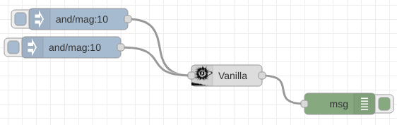

# node-red-contrib-viteyss

 node-red contrib viteyss wrapper.

### dependencies

- Node-red
- viteyss
- mnodehttp
- node-yss

### installation

* Manual way.
  Be shure that your Node-Red is stop. In terminal go to directory of your `.node-red` 

```bash
cd ~/.node-red
npm i https://github.com/yOyOeK1/node-red-contrib-viteyss.git
npm i @rollup/rollup-linux-x64-gnu
```

* After this start *Node-Red* service. Icon of node will be in node list


* Drag and drop it. 

* Do configuration of instance. 

  **Your done**

  In your web browser of your choice enter http://localhost:8083

Use `local wiki` host by your instance to start exploring **sites**

http://localhost:8083/yss/index.html#pageByName=Wiki


### example flow

In Node-Red you can import `example/flows.json` file to see it set up and running. You can import file as `cunnernt flow` or `new flow`



[json file to download ...](./examples/flows.json)


#### links

[viteyss](https://github.com/yOyOeK1/viteyss), [otdm-yss](https://github.com/yOyOeK1/oiyshTerminal/wiki/otdm-yss), [sites as otdm-family](https://github.com/yOyOeK1/oiyshTerminal/wiki/otdm-yss#otdm-family)


### check list v0.0.1

- [ ] http crash when port / host is allready taken 
- [ ] wiki need to work in current relative path 
- [x] viteyss first contact with node-red